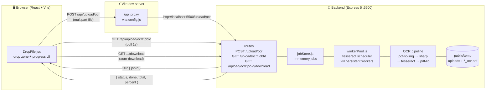
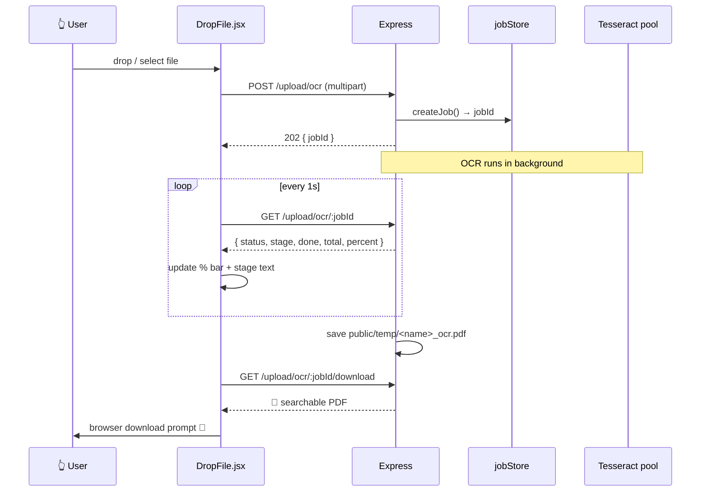
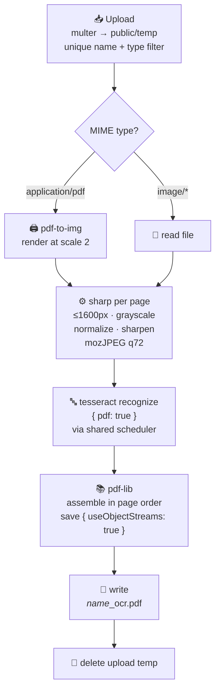

<div align="center">

# 🔎 FindablE

### Drop a scan. Get back a searchable PDF.

Turn piles of scanned PDFs and photos of documents into **searchable, selectable-text PDFs** — right from your browser, with live progress.

[](https://nodejs.org/)
[](https://react.dev/)
[](https://vite.dev/)
[](https://tailwindcss.com/)
[](https://expressjs.com/)
[](https://tesseract.projectnaptha.com/)
[](./Backend/package.json)

</div>

---


---

## ✨ Features

| Feature | Details |
|---|---|
| 📄 PDF + 🖼️ image input | PDFs, PNG, JPEG, WebP, TIFF, BMP |
| 🔍 Searchable output | Invisible text layer embedded over the original pages |
| 📡 Live progress | Real per-page progress (`OCR-ing page 3/8…`) polled every second |
| ⚡ Fast | Persistent Tesseract worker pool — no per-upload startup cost |
| 🗜️ Small outputs | JPEG-compressed pipeline + compressed PDF save (KBs per page, not MBs) |
| 💾 Auto-saved results | Every result kept in `Backend/public/temp/<name>_ocr.pdf` |
| ⬇️ Auto-download | Finished PDF downloads automatically in the browser |
| 🧲 Drag & drop UI | Glassmorphism drop zone with spinner, progress bar and status states |

---

## 🏗️ Architecture

### System overview



> The browser only ever talks **same-origin** to Vite — the dev proxy forwards to Express, so **no CORS** is involved during development.

### Request lifecycle (async job model)



### OCR pipeline (per file)



**Why it's fast *and* small:** Tesseract embeds whatever image you hand it into its output PDF — so the pipeline hands it a ≤1600px mozJPEG (~100–250 KB/page) instead of a 2000px PNG (~1–2 MB/page). Fewer pixels also means faster recognition. The worker pool is built once and prewarmed at boot, saving ~5–15 s of startup per upload. Rendering (`scale: 2`) overlaps OCR page-by-page instead of running in two serial phases.

### Backend module map

```
Backend/src/
├── index.js                     # boots Express, prewarms pool, graceful shutdown
├── app.js                       # cors + parsers + static + JSON error middleware
├── routes/ocrenable.routes.js   # POST /ocr · GET /ocr/:jobId · GET /ocr/:jobId/download
├── controllers/ocr.controller.js# startOcr (202) · processJob (background) · status · download
├── middlewares/multer.middleware.js  # disk storage, unique names, image/PDF filter
└── utils/
    ├── workerPool.js            # singleton Tesseract scheduler (CONCURRENCY workers)
    ├── jobStore.js              # in-memory jobs + 2h TTL sweep
    ├── pdfToOcr.js              # multi-page pipeline with progress callbacks
    ├── imgToOcr.js              # single-image pipeline with progress callbacks
    ├── imgToPdf.js              # sharp clean → tesseract → 1 searchable page
    └── asyncHandler.js          # async error wrapper
```

### Frontend module map

```
Frontend/src/
├── App.jsx                      # Navbar + HeroSec
├── components/
│   ├── Navbar.jsx               # brand header
│   ├── HeroSec.jsx              # explainer + tech list
│   └── DropFile.jsx             # ⭐ upload → poll → progress UI → auto-download
└── vite.config.js               # /api → http://localhost:5500 proxy
```

### Tech stack

| Layer | Technology | Role |
|---|---|---|
| UI | React 19, Vite 7, Tailwind CSS 4 | Drop zone, live progress, auto-download |
| API | Express 5, Multer, CORS, dotenv | Upload, job API, static results |
| OCR engine | Tesseract.js 7 (LSTM-only, local `eng.traineddata`) | Image → text + searchable PDF layer |
| Imaging | sharp | Grayscale, contrast, sharpen, JPEG compress |
| PDF render | pdf-to-img (pdf.js) | PDF pages → images |
| PDF build | pdf-lib | Merge OCR pages, compressed save |
| Progress | In-memory job store + 1 s polling | `queued → rendering → ocr → assembling → saving → done` |

---

## 🚀 Run it locally

**Prerequisites:** Node.js ≥ 20.

```bash
# 1. fork + clone
git clone https://github.com/Atishay-j-a-in/Findable.git
cd Findable
```

**Terminal 1 — backend** (port `5500`):

```bash
cd Backend
npm install
npm run dev        # node --watch src/index.js
```

Wait for `✅ [ocr] pool ready (4 workers)` — workers are prewarmed so the first upload is fast.

**Terminal 2 — frontend** (Vite dev server):

```bash
cd Frontend
npm install
npm run dev
```

Open the Vite URL (usually http://localhost:5173), drop a scan, and watch the progress ring. ✨

> ⚠️ Both servers must be running: the frontend talks to the backend through the Vite `/api` proxy.

---

## 🔌 API reference

| Method | Endpoint | Description |
|---|---|---|
| `POST` | `/upload/ocr` | Multipart upload (`file` field) → `202 { jobId }` |
| `GET` | `/upload/ocr/:jobId` | `{ status, stage, done, total, percent, resultName, error }` |
| `GET` | `/upload/ocr/:jobId/download` | Finished PDF (`409` if not ready, `404` if unknown/expired) |

Accepted types: `application/pdf`, `image/png`, `image/jpeg`, `image/webp`, `image/tiff`, `image/bmp`. No file-size cap. Results persist at `Backend/public/temp/<original>_ocr.pdf` (also served statically at `/temp/...`).

---

## ⚙️ Configuration

| Variable | Default | Effect |
|---|---|---|
| `PORT` | `5500` | Backend listen port (proxy target must match) |
| `CORS_ORIGIN` | — | Allowed browser origin for direct (non-proxy) calls |
| `OCR_CONCURRENCY` | `min(CPU count, 4)` | Tesseract workers — more = faster multi-page, more RAM |
| `OCR_RENDER_SCALE` | `2` | PDF render resolution — raise to `3` only if tiny fonts misread |

---

## 🗺️ Roadmap ideas

- [ ] Language selector (Hindi, etc. — drop more `.traineddata` files in `Backend/`)
- [ ] WebSocket/SSE progress instead of polling
- [ ] Download history page backed by `public/temp`
- [ ] Page-range selection for huge PDFs
- [ ] Docker Compose (one-command `up`)

---

<div align="center">

Built with ❤️ — drop a file, make it **FindablE**. 🔎

</div>
